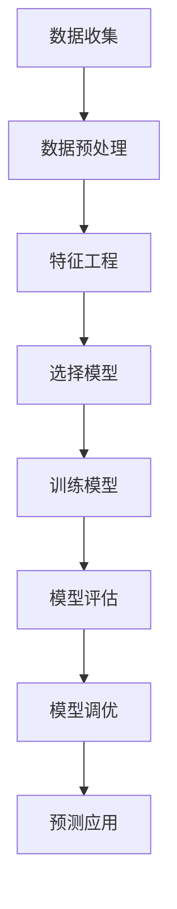

# 机器学习基础：从数据到预测

## 🎯 学习目标
- 理解机器学习的基本工作原理
- 掌握监督学习、无监督学习和强化学习的区别
- 了解常见的机器学习算法及其应用场景
- 认识模型训练、验证和测试的基本流程
- 理解过拟合和欠拟合的概念及解决方法

## 📚 核心内容

### 1. 机器学习的基本范式

#### 监督学习（Supervised Learning）
- **定义**：从有标签的数据中学习规律，用于预测未知数据的标签
- **典型任务**：分类（Classification）、回归（Regression）
- **常见算法**：线性回归、逻辑回归、决策树、支持向量机、神经网络
- **应用实例**：房价预测、垃圾邮件分类、图像识别

#### 无监督学习（Unsupervised Learning）
- **定义**：从无标签的数据中发现内在结构和规律
- **典型任务**：聚类（Clustering）、降维（Dimensionality Reduction）
- **常见算法**：K-Means聚类、主成分分析（PCA）、自编码器
- **应用实例**：客户分群、异常检测、推荐系统

#### 强化学习（Reinforcement Learning）
- **定义**：通过与环境交互，学习最优行为策略
- **核心概念**：智能体（Agent）、环境（Environment）、奖励（Reward）
- **常见算法**：Q-Learning、深度Q网络（DQN）、策略梯度
- **应用实例**：AlphaGo、自动驾驶、机器人控制

### 2. 机器学习的工作流程



#### 关键步骤详解：

**数据预处理**
- 数据清洗：处理缺失值、异常值
- 数据标准化：统一数据尺度
- 数据分割：训练集、验证集、测试集（通常比例：70%-15%-15%）

**特征工程**
- 特征选择：选择最相关的特征
- 特征提取：从原始数据中提取有用信息
- 特征转换：将特征转换为更适合模型的格式

### 3. 模型性能评估

#### 分类问题评估指标
- **准确率（Accuracy）**：正确预测的比例
- **精确率（Precision）**：预测为正例中实际为正例的比例
- **召回率（Recall）**：实际为正例中被正确预测的比例
- **F1分数**：精确率和召回率的调和平均数

#### 回归问题评估指标
- **均方误差（MSE）**：预测值与真实值差的平方的平均值
- **平均绝对误差（MAE）**：预测值与真实值绝对差的平均值
- **R²分数**：模型解释数据变异的比例

### 4. 过拟合与欠拟合

#### 过拟合（Overfitting）
- **表现**：在训练集上表现很好，在测试集上表现很差
- **原因**：模型过于复杂，学习了训练数据的噪声
- **解决方法**：
  - 增加训练数据
  - 简化模型结构
  - 正则化（L1、L2正则化）
  - Dropout（神经网络）

#### 欠拟合（Underfitting）
- **表现**：在训练集和测试集上都表现不佳
- **原因**：模型过于简单，无法捕捉数据中的规律
- **解决方法**：
  - 增加模型复杂度
  - 增加特征数量
  - 减少正则化程度

### 5. 偏差-方差权衡

```
模型复杂度 ↗️  →  偏差 ↘️  方差 ↗️
模型复杂度 ↘️  →  偏差 ↗️  方差 ↘️
```

- **偏差（Bias）**：模型预测值的期望与真实值之间的差距
- **方差（Variance）**：模型对训练数据微小变化的敏感程度
- **目标**：找到偏差和方差的最佳平衡点

## 💭 思考与讨论

### 引导问题：
1. 监督学习和无监督学习的核心区别是什么？各自适用于什么场景？
2. 为什么需要将数据集分为训练集、验证集和测试集？
3. 如何判断一个模型是过拟合还是欠拟合？应该分别如何处理？
4. 在机器学习中，数据质量和特征工程哪个更重要？

### 拓展思考：
- 如何处理类别不平衡问题（如欺诈检测中欺诈样本很少的情况）？
- 什么是交叉验证？为什么它比单次划分数据集更可靠？
- 在大数据时代，机器学习模型是否还需要特征工程？
- 如何解释机器学习模型的预测结果？（可解释AI）

## 📝 你的反馈
希望降低难度，从最简单的原理开始学习，并在知识点举出简单易懂的例子

**下一步学习建议：**
- 建议学习Python的NumPy、Pandas库进行数据处理
- 可以尝试使用Scikit-learn实现简单的机器学习算法
- 思考你希望深入哪个具体算法或应用领域